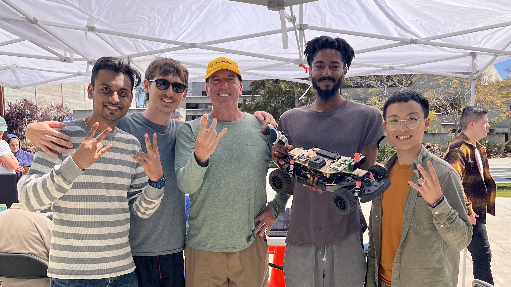

<h1 align="center">:cat: The Pet Cat Bot </h1>

    

<!-- PROJECT LOGO -->
 

  
<h3>Team 8 | UCSD ECE / MAE 148: Autonomous Vehicle | Final Project</h3>

Winter 2023

- Mekhi Ellington (ECE)
- Mikhail Rossoshanskiy (ECE)
- Dehao Lin (MAE)
- Sankalp Kaushik (MAE)

## Project Overview
We are building a laser-guided GPS mapper robot that functions as a cat.

## :octocat: Key Features
Our robot has two main features:

    1. Interactive control with laser;

    2. Collecting the route data.

That means we can guide the robot with a laser pointer, just like how we play with cats. The robot automatically collects location data while operating, and will save the location data for mapping around the area. 

PICTURE/VIDEO HERE 

## What have we done?
To achieve these two features, we focused our work on our VESC module, GNSS module, and OAKD Lite Camera module.

### VESC module - PyVESC
steering and throttle trying for analog stuff

### GNSS module - 
location errors and data parsing 

### OAKD Lite Camera module - 
color detection and computer vision

## Contact

* Mekhi Ellington - mellingt@ucsd.edu
* Mikhail Rossoshanskiy - mrossosh@ucsd.edu
* Dehao Lin - delin@ucsd.edu
* Sankalp Kaushik - sskaushi@ucsd.edu 

