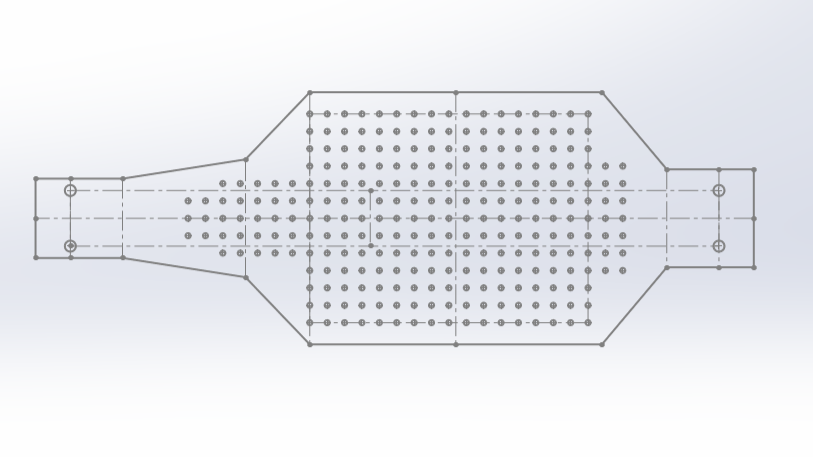
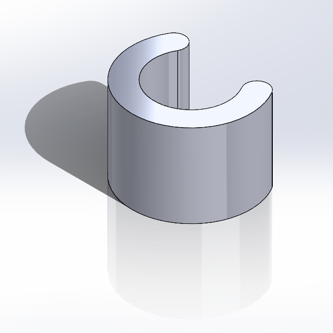
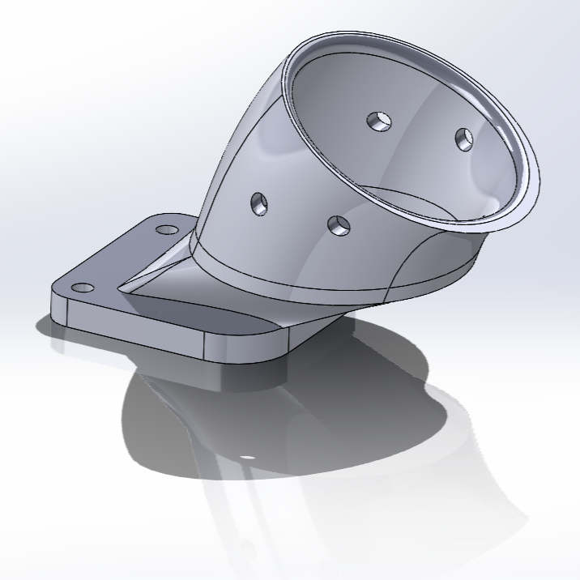
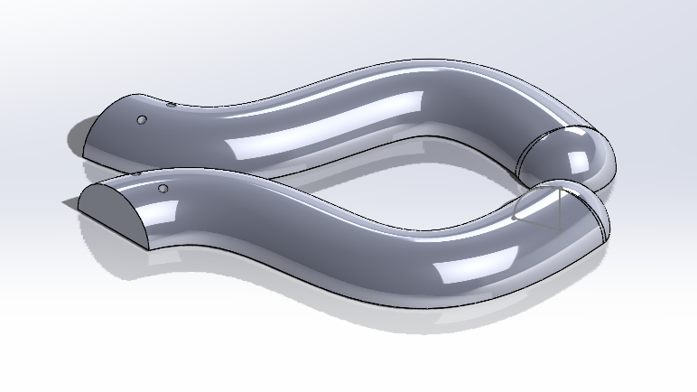

<h1 align="center">:cat: The Pet Cat Bot </h1>

    

<!-- PROJECT LOGO -->
 

    
<h3>Team 8 | UCSD ECE / MAE 148: Autonomous Vehicle | Final Project</h3>

Spring 2023

- Mekhi Ellington (ECE)
- Mikhail Rossoshanskiy (ECE)
- Dehao Lin (MAE)
- Sankalp Kaushik (MAE)

## Project Overview
We are building a laser-guided GPS mapper robot that functions as a cat.

## :octocat: Key Features
Our robot has two main features:

    1. Interactive control with laser

    2. Collecting the route data

That means we can guide the robot with a laser pointer, just like how we play with cats. The robot automatically collects location data while operating, and will save the location data for mapping around the area. 

## Tracking Algorithm Demo Video

## Car Demo Video

## What have we done?
To achieve these two features, we focused on our VESC, GNSS, and OAKD Lite Camera modules.

### VESC module - PyVESC
To implement movement and commands to the VESC. We ended up using the PyVESC Library. We were able to directly put values into the VESC script that would control the Servo and the Throttle control of the VESC. In PyVESC any value from 0.0 to 1.0 controls the steering of the servos with 0.0 making the wheels point all the way to the left. Meanwhile, 1.0 would point it to the right. It's the same thing with Throttle control, with 0 being no movement and 1.0 being maxed throttle on the Motor. 
For implementation, we had to tweak certain parts of this. First, We found the speed of the VESC going from 0 to 1.0 is extremely fast. The first thing we did was set a threshold value on how fast it is capped at going even while at 100% throttle. We ended up using 0.35 as our threshold value. 
For the servo controls we started off using boundary boxes going from the left and the right of the camera's frame. With our 720x720 captured box from the camera. Initially, for the right, the values were set to less than 120 pixels of the frame would have the bot point directly left with a vESC value of 0.0, while servo point 0.35 would be less than pixel 180 and then 0.45 for less than 240. This is mirrored on the right side of the camera view but opposite. This resulted in very jerky servo movements at first but this ended up not working in the long run.
We ended up just switching to completely Analog steering. Instead, we just set the current pixel a laser is seen on and put it over 720 (720x720 pixel capture window) This results in us getting literally 720 points that we can accurately turn to after implementation. 

### GNSS module - Data Parsing
When implementing the GNSS module we had a lot of issues but eventually got it functioning. At first, we attempted to use Donkeycar and quickly found out that it would not work with our PyVESC script. We ended up finding a few other Python libraries and found that the serial library in Python works without any issues. 
Implementing the Serial library allowed us to point the library to the port where the GNSS is connected and then gather the information. We then wrote a portion within our script that would gather the GPS information and then write it to a file within the Jetson. We found out that there was a lot of garbage information being captured by the GNSS that we really do not need, things like the Location of the Satellites and speed and everything. We only needed Longitude and Latitude so we ended up having to write a separate script that pulls each line from the file with GNSS information and then parses it to extract only the Longitude and Latitude split apart by a comma in between. We then had this be written to a file and it ended up being perfect.
We then could find an online mapper and send our file into it to plot the data points collected. An issue we found out is that our points were coming up in the middle of the Ocean off the coast of Mexico. However, they were all still relative to one another so it didn't change the overall path the cat took while chasing the laser. If we had more time we would fix this and overlap the data points over the UCSD campus or whichever location this device is run at. 

### OAKD Lite Camera module - openCV/depthAI

We utilized openCV libraries and depthAI repo integration to provide us with the frames and image processing capabilities. We created our own laser tracking algorithm that accurately tracks a laser pointer in the camera's frame. This was done with masking and image threshold techniques. By applying two color thresholds, white and red/black" we are able to isolate the brightest spot in the frame. This action is done by the cv2.Range() function that compares our camera frame to the thresholds. This in turn creates a black-and-white mask that shows only the laser pointer in the original frame. We next extract the location of the brightest spot on the image using cv2.MinMaxLoc(). These coordinates are then ready to be used by the steering and throttle algorithms as we are able to isolate the X and Y values (pixels) of the pointer's location "maxLoc[0] and maxLoc[1]". 

### Mechanical & Asthetic Designs

    
    
Electronic Mounting plate design

    
    
Suspension K constant adjustment standoffs

    
    
Cat tail mounting

    
    
Cat tail

## Contact

* Mekhi Ellington - mellingt@ucsd.edu
* Mikhail Rossoshanskiy - mrossosh@ucsd.edu
* Dehao Lin - delin@ucsd.edu
* Sankalp Kaushik - sskaushi@ucsd.edu

## Final Project Documentation

* [Final Project Presentation](https://docs.google.com/presentation/d/1CmsSRDc4tJDKef6RWzisFBF3TMSWqy2-ThQkxXycnEY/edit?usp=sharing)

